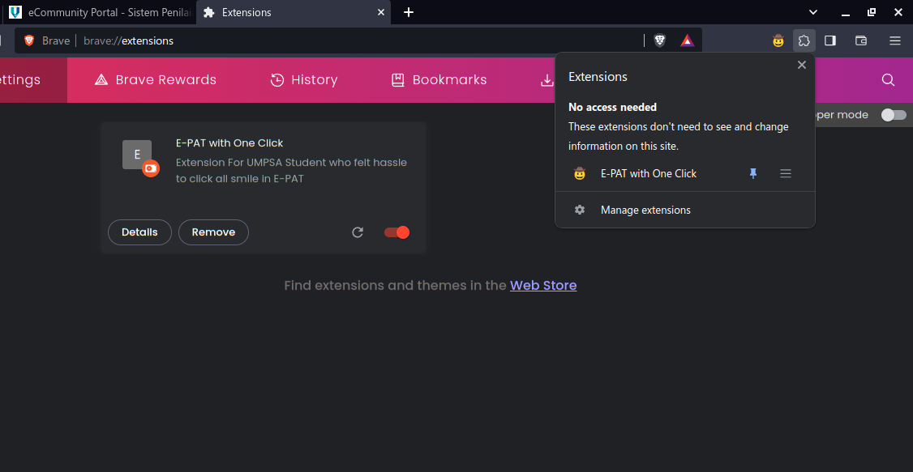
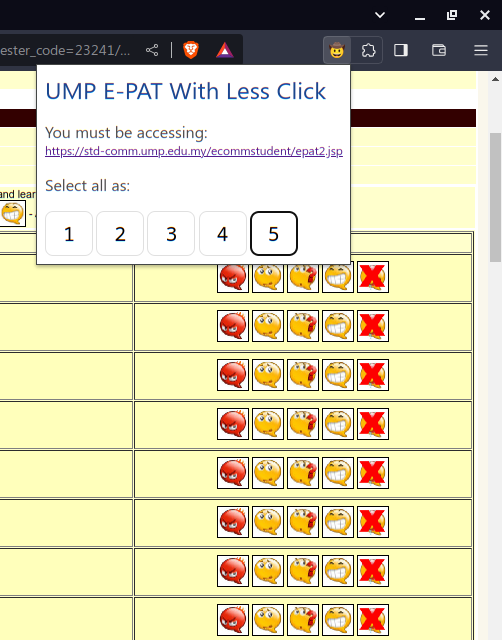

# Get Started On Chrome-based Browser

1. Download me: Click `Code` (the green button above), **download zip** & extract to your PC
2. Open Chrome, go to `chrome://extensions/`
3. Turn ON **Developer mode** (at top right)
4. Click `Load unpacked`
5. On pop up, choose the folder `epat-with-one-click`
6. Done. Now, login https://ecomm.ump.edu.my and go to `Instructional Evaluation (E-PAT)` to try.

# How To Use
1. Click "Extension" on top-right, you should see "E-PAT with One Click".
2. (Optional) Pin the extension
3. Open "Evaluation Form", click the extension.
4. Select rating. That's it.

# Example

